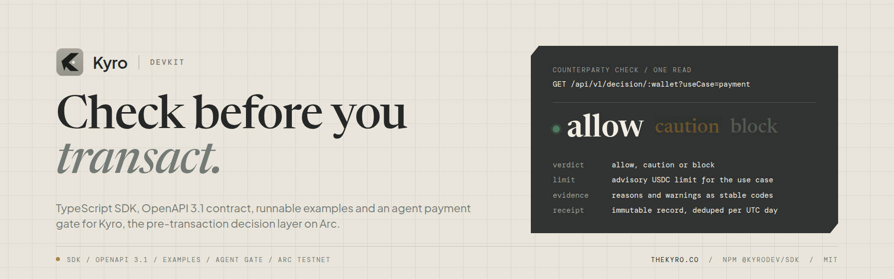
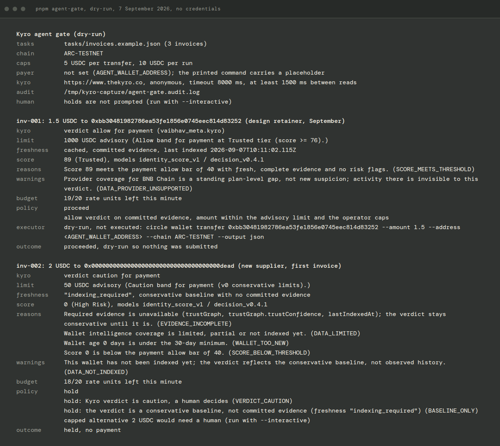

<p align="center">
  
</p>

<h1 align="center">Kyro devkit</h1>

<p align="center">
  <a href="https://www.npmjs.com/package/@kyrodev/sdk"></a>
  <a href="https://github.com/vaibhav0xq/kyro-devkit/actions/workflows/ci.yml"></a>
  <a href="./LICENSE"></a>
  <a href="./spec/kyro-openapi.yaml"></a>
  
</p>

<p align="center">
  <a href="https://www.thekyro.co">Live app</a> ·
  <a href="https://www.thekyro.co/check">Wallet check</a> ·
  <a href="https://docs.thekyro.co">Docs</a> ·
  <a href="./docs/API.md">API on one page</a> ·
  <a href="./packages/sdk/README.md">SDK guide</a> ·
  <a href="./demos/agent-gate/README.md">Agent gate demo</a> ·
  <a href="./CHANGELOG-ETHONLINE.md">Changelog</a>
</p>

Kyro is a pre-transaction decision layer for wallets on Arc. Before funds
move, a caller checks a wallet and gets an **allow / caution / block** verdict,
an advisory USDC limit for the use case, the evidence behind the answer and an
optional immutable receipt. Kyro never holds keys or funds. The caller keeps
the final say.

This repository is the public developer kit for that API: the TypeScript SDK
published as [`@kyrodev/sdk`](https://www.npmjs.com/package/@kyrodev/sdk),
the OpenAPI 3.1 contract, runnable examples in three languages, an agent
payment demo built on the Circle CLI and the documentation to go with them.
The product itself runs at https://www.thekyro.co and is not part of this
repository.

## Contents

- [Status](#status)
- [Try it in 60 seconds](#try-it-in-60-seconds)
- [Use the SDK](#use-the-sdk)
- [Not writing TypeScript?](#not-writing-typescript)
- [Agent gate demo](#agent-gate-demo)
- [How Kyro decides](#how-kyro-decides)
- [Architecture](#architecture)
- [Repository map](#repository-map)
- [Working on this repository](#working-on-this-repository)
- [ETHOnline 2026](#ethonline-2026)
- [Links](#links)
- [Disclaimers and trademarks](#disclaimers-and-trademarks)
- [License](#license)

## Status

- Live on **Arc Testnet** today. Every read example and the default dry-run of
  the agent gate demo run against the production deployment with no
  credentials. Only the demo's live mode needs a wallet and a Circle CLI
  session, both yours.
- Arc **mainnet** activation is scheduled for 16 September 2026. Until the
  evidence links appear in [`CHANGELOG-ETHONLINE.md`](./CHANGELOG-ETHONLINE.md),
  Kyro is not on mainnet.
- Advisory and non-custodial. Kyro never holds keys or funds and never moves
  them. It does not perform AML screening and does not provide legal,
  sanctions or regulatory compliance determinations.
- Independent community project, no external audit yet. Evidence for young
  wallets is thin by definition and the API says so instead of guessing.
- The `v1` surface is frozen: fields and error codes may be added, nothing is
  removed or renamed. This repository pins a checksummed snapshot of the
  contract in [`spec/`](./spec/README.md).

## Try it in 60 seconds

No account, no key, no wallet connection. Anonymous callers get 20 rate units
per minute per IP. Each call below spends one unit; a score read that finds a
known wallet stale can spend five more while it starts a background rescan.

```sh
BASE=https://www.thekyro.co/api/v1
WALLET=0xbb30481982786ea53fe1856e0745eec814d83252

# 1. Score snapshot
curl -s "$BASE/score/$WALLET"

# 2. Decision for a payment: verdict, advisory USDC limit, reasons, evidence, freshness
curl -s "$BASE/decision/$WALLET?useCase=payment"

# 3. The same read for a wallet Kyro has never indexed: a conservative baseline, not a guess
curl -s "$BASE/decision/0x000000000000000000000000000000000000dEaD?useCase=payment"
```

Trimmed answers from 6 September 2026. Scores move as evidence is re-indexed,
so the numbers you get will differ; the shape will not.

```jsonc
// 1. score
{ "ok": true, "version": "v1", "data": {
  "wallet": "0xbb30481982786ea53fe1856e0745eec814d83252",
  "username": "vaibhav_meta.kyro",
  "score": 89, "scoreModelVersion": "identity_score_v1",
  "riskLevel": "Trusted", "badge": "Trusted Wallet Credential",
  "activeChains": ["Ethereum Mainnet", "Base", "Polygon", "Arc Testnet"],
  "cacheStatus": "cached", "lastIndexedAt": "2026-09-05T18:20:44.987Z" } }

// 2. decision, payment
{ "ok": true, "version": "v1", "data": {
  "decision": "allow",
  "recommendedLimit": { "amountUsdc": 1000, "currency": "USDC" },
  "score": 89, "riskLevel": "Trusted",
  // reasons[], warnings[], evidence.used[] and evidence.missing[] trimmed: each entry is a machine-readable code plus a message
  "freshness": { "cacheStatus": "cached" },
  "scoreModelVersion": "identity_score_v1",
  "decisionModelVersion": "decision_v0.4.1" } }

// 3. decision for a never-indexed wallet
{ "ok": true, "version": "v1", "data": {
  "decision": "caution",
  "recommendedLimit": { "amountUsdc": 50, "currency": "USDC" },
  "score": 0, "riskLevel": "High Risk",   // conservative baseline, not observed history
  // reasons[] name the missing evidence; warnings[] carry a not-indexed notice
  "freshness": { "cacheStatus": "indexing_required", "lastIndexedAt": null },
  "decisionModelVersion": "decision_v0.4.1" } }
```

More calls (batch, trust graph, profile, receipts, intake) in
[`examples/curl`](./examples/curl/README.md). The whole API fits on one page
in [`docs/API.md`](./docs/API.md).

## Use the SDK

`@kyrodev/sdk` wraps all 10 public v1 operations with typed methods, one
error model and rate limit metadata. Zero runtime dependencies, ESM and CJS
builds, Node 18.17 or newer or any runtime with a WHATWG `fetch`.

```sh
npm install @kyrodev/sdk
# or
pnpm add @kyrodev/sdk
```

```ts
import { Kyro, KyroApiError } from "@kyrodev/sdk";

const kyro = new Kyro(); // anonymous: 20 rate units per minute per IP

const decision = await kyro.decisions.check(counterparty, { useCase: "payment" });

if (decision.decision === "allow" && amountUsdc <= decision.recommendedLimit.amountUsdc) {
  await sendUsdc(counterparty, amountUsdc);
} else {
  hold(decision.reasons); // caution, block or over the advisory limit
}
```

| Method | Operation |
| --- | --- |
| `kyro.score.get(wallet)` | Score snapshot |
| `kyro.decisions.check(wallet, { useCase })` | Verdict plus advisory USDC limit |
| `kyro.decisions.batch(inputs, { useCase })` | Up to 10 wallets in one call anonymously |
| `kyro.receipts.create({ wallet, useCase })`, `kyro.receipts.get(id)` | Immutable decision receipts |
| `kyro.trust.get(wallet)` | Verified-relationship trust graph |
| `kyro.interactionGraph.get(wallet)`, `.refresh(wallet)` | Observed counterparties, keyed refresh |
| `kyro.profile.get(username)` | Public summary of a claimed username |
| `kyro.intake.start(wallet)` | Index a wallet Kyro has not seen |

Configuration (API key, base URL, timeouts, custom `fetch`, rate limit
callback), the error classes, cancellation and the full export list are in
the [SDK guide](./packages/sdk/README.md). API keys are server-side only and
raise the rate budget to the key's plan; every method except
`interactionGraph.refresh` works without one.

The runtime code published as 0.1.0 on npm is byte-identical to the build
this repository produces. The published 0.1.0 type declarations predate the
additive interaction graph native value fields (`metrics.value`,
`capabilities.value`); the declarations built from this repository include
them.

## Not writing TypeScript?

- [`examples/python/kyro_quickstart.py`](./examples/python/kyro_quickstart.py):
  standard library only, exits 0 / 2 / 3 for proceed / hold / block.
- [`examples/curl/kyro.sh`](./examples/curl/kyro.sh): every operation from the
  shell with argument checks and rate limit headers.
- [`spec/kyro-openapi.yaml`](./spec/kyro-openapi.yaml): OpenAPI 3.1, feed it
  to any client generator or API client. Provenance and checksum in
  [`spec/README.md`](./spec/README.md).
- [`docs/API.md`](./docs/API.md): operations, envelope, authentication, rate
  limits and no-score semantics on one page.

## Agent gate demo

[`demos/agent-gate`](./demos/agent-gate/README.md) is a small agent that pays
USDC invoices on Arc Testnet through the Circle CLI, with Kyro in the approval
path. A scripted planner proposes each payment, the gate reads the Kyro
decision anonymously, an operator policy turns the verdict into proceed, hold
or refuse and every step lands in a JSONL audit log. Kyro never moves funds
and never blocks a transaction; the agent's own policy does.

```
planner  ->  pre-screen  ->  Kyro decision read  ->  operator policy  ->  decision receipt  ->  audit  ->  executor
             (no network)    (anonymous, 1 unit)    (proceed / hold / refuse) (live or --receipts on)      (Circle CLI)
```

```bash
pnpm install
pnpm run build          # builds @kyrodev/sdk, which the demo imports from the workspace
pnpm agent-gate         # dry-run, no credentials, three anonymous rate units
```

<p align="center">
  
</p>

The first two of three invoices from a dry-run on 7 September 2026. The task
file ships three scenes: a claimed identity inside every limit (proceed), a
wallet Kyro has never indexed (hold) and an amount above the advisory limit
(hold with a capped alternative). In dry-run a proceed prints the exact
Circle CLI command and executes nothing. `pnpm agent-gate -- --simulate timeout`
shows the gate failing closed when Kyro cannot answer, without a network call.

`--mode live` runs the same gate with a real executor: one Circle CLI transfer
per proceed from an agent wallet you control, with an idempotency key, the
CLI's JSON answer read into submitted, failed or unknown and reconcile steps
printed after an unknown. It needs a Circle CLI testnet agent session and
`AGENT_WALLET_ADDRESS` on your machine; nothing in this repository carries
credentials. In live mode (or with `--receipts on` in dry-run) every proceed
also mints a Kyro decision receipt before the executor runs, printed as a
share URL and recorded on the audit line; a receipt that disagrees with the
read holds the payment and a receipt that cannot be minted refuses it. The
demo README covers Windows, preflight, caps, receipts, the audit log and
exit codes.

The first live transfer through the gate ran on 9 September 2026 on Arc
Testnet: 1.5 USDC, state `COMPLETE`, transaction
[`0xe855692eff6927a7711c7dc483db6b82c4132d29eadbdd63f8a49165fe14f873`](https://testnet.arcscan.app/tx/0xe855692eff6927a7711c7dc483db6b82c4132d29eadbdd63f8a49165fe14f873).
[`CHANGELOG-ETHONLINE.md`](./CHANGELOG-ETHONLINE.md) has the entry.

## How Kyro decides

- **Score** `identity_score_v1`: 0 to 100 from indexed evidence, with a
  published component breakdown, a risk level and a badge. Deterministic and
  versioned, so the same evidence always yields the same score.
- **Decision** `decision_v0.4.1`: verdict plus an advisory USDC limit for
  `payment`, `escrow`, `lending` or `marketplace`, with machine-readable
  reason and warning codes, the evidence used and missing plus freshness and
  coverage blocks.
- **Receipts**: an immutable record of a decision, hashed, deduped per UTC
  day, readable by anyone with the id.
- **No-score semantics**: a wallet without a committed snapshot gets a
  conservative baseline with `freshness.cacheStatus` of `indexing_required`,
  never a fabricated verdict. Intake indexes it on demand.

Reason and warning codes, score components and the safe integration pattern
are documented at https://docs.thekyro.co.

## Architecture

<p align="center">
  
</p>

Graphite plates are the parts Kyro runs; paper cards are callers, wallets and
chains. No Kyro component crosses the custody boundary: keys, funds and the
final decision stay with the caller. The lane-by-lane walkthrough is in
[`docs/ARCHITECTURE.md`](./docs/ARCHITECTURE.md), with a 2x export for print.

## Repository map

```
packages/sdk             @kyrodev/sdk source, tests, build (MIT)
spec/                    OpenAPI 3.1 snapshot of the public contract, with checksum
examples/curl            copy-paste calls and kyro.sh
examples/python          stdlib quickstart
examples/typescript      SDK quickstart wired to the workspace build
demos/agent-gate         Circle CLI agent with Kyro in the payment approval path
docs/                    API one-pager, architecture outline, README images
.github/workflows        CI: spec drift, typecheck, tests, build, example parse checks
CHANGELOG-ETHONLINE.md   pre-existing work versus event-window work, dated
CONTRIBUTING.md          how to propose changes and what belongs here
SECURITY.md              how to report a vulnerability
```

## Working on this repository

```sh
pnpm install       # Node 20 or newer for the toolchain; the built SDK runs on Node 18.17+
pnpm verify        # spec drift check, typecheck, tests, build, dist smoke, examples and demo checks
pnpm quickstart    # runs examples/typescript against the live API
```

`pnpm verify` is what CI runs on Node 20 and 22. Tests use a mocked `fetch`
and never reach the network. Any change to `spec/kyro-openapi.yaml` must
regenerate the SDK types in the same commit; `pnpm check:generated` fails
otherwise. Guidelines for issues and pull requests are in
[`CONTRIBUTING.md`](./CONTRIBUTING.md). Vulnerabilities go through
[`SECURITY.md`](./SECURITY.md), not the issue tracker.

## ETHOnline 2026

Submitted on the ETHGlobal Continuity Track to Arc's Best DeFi or Agentic
Application prize, with the agent gate as the agentic case. Kyro existed
before the event; the dated split between pre-existing work and work done in
the event window, together with the AI assistance disclosure, lives in
[`CHANGELOG-ETHONLINE.md`](./CHANGELOG-ETHONLINE.md).

## Links

| | |
| --- | --- |
| Live app | https://www.thekyro.co |
| Wallet check | https://www.thekyro.co/check |
| Developer page (plans, key requests) | https://www.thekyro.co/developers |
| Console (key management for approved accounts) | https://console.thekyro.co |
| Docs | https://docs.thekyro.co ([quickstart](https://docs.thekyro.co/quickstart), [API reference](https://docs.thekyro.co/api-reference), [safe integration](https://docs.thekyro.co/safe-integration), [reason and warning codes](https://docs.thekyro.co/reason-warning-codes)) |
| OpenAPI spec, served | https://www.thekyro.co/kyro-openapi.yaml |
| npm | https://www.npmjs.com/package/@kyrodev/sdk |
| Updates | https://x.com/KyroIdentity |
| Contact | arcidentity.build@gmail.com |

## Disclaimers and trademarks

Kyro gives advisory signals from public on-chain evidence. A verdict is an
input to your own decision, not a guarantee about a counterparty. Kyro accepts
no liability for transactions made with or without it. Kyro is not a
custodian, a wallet, an exchange or a compliance provider.

Everything in this repository targets Arc Testnet unless stated otherwise;
testnet USDC has no monetary value. Kyro is an independent project and is not
affiliated with, endorsed by or sponsored by Circle Internet Group, Arc or
ETHGlobal. USDC, Circle and Arc are trademarks of their respective owners and
are used here only to describe compatibility.

## License

MIT for everything in this repository unless a directory carries its own
LICENSE file. See [LICENSE](./LICENSE).
