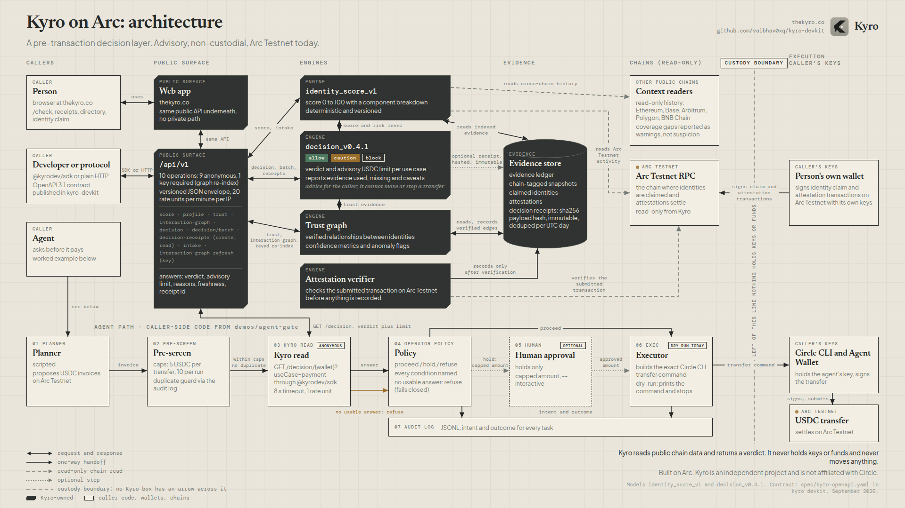
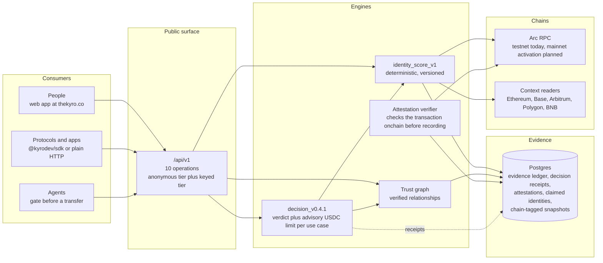

# Kyro architecture

Kyro is a pre-transaction decision layer. A caller names a wallet and a use
case; Kyro answers allow / caution / block, an advisory USDC limit and,
optionally, an immutable receipt. Nothing custodial sits in the path: Kyro
never holds keys or funds and the caller keeps the final say.

The board is committed as `docs/architecture.png` (1920x1080) and
`docs/architecture@2x.png` (3840x2160, for print and zoom). Graphite plates
are the parts Kyro runs; paper cards are callers, wallets and chains. Nothing
Kyro runs has an arrow across the custody boundary. The bottom band walks the
agent path from `demos/agent-gate` as caller-side code. The outline below is
the same structure in text.

## Layers, left to right

**Consumers.** Three kinds of caller use the same API: people through the web
app (check a wallet, claim an identity, submit attestations), protocols and
applications through the SDK or raw HTTP and agents that call Kyro
immediately before a transfer and act on the verdict. The agent case is
worked through in `demos/agent-gate`, where an operator policy turns the
verdict into proceed, hold or refuse ahead of a Circle CLI transfer.

**Public surface.** `www.thekyro.co` is a Next.js App Router application.
`/api/v1` exposes 10 operations behind a versioned JSON envelope.
Everything works anonymously at 20 rate units per minute per IP; an API key
raises the budget and is required for exactly one operation, the interaction
graph re-index. The contract is published as OpenAPI 3.1 and vendored in this
repository.

**Engines.**
- `identity_score_v1` turns indexed evidence into a 0 to 100 score with a
  published component breakdown. It is deterministic and versioned: the same
  evidence yields the same score and the version travels with every answer.
- `decision_v0.4.1` maps score, risk level, trust evidence and freshness to a
  verdict and an advisory USDC limit for the named use case. It reports the
  evidence it used, the evidence it lacked and the coverage caveats behind the
  answer.
- The trust graph records verified relationships between claimed identities,
  with reciprocity, anomaly flags and confidence metrics.
- The attestation verifier checks a submitted transaction onchain before an
  attestation is recorded, so trust edges are backed by settled activity.

**Evidence.** Postgres holds the evidence ledger, decision receipts,
attestations, claimed identities and chain snapshots. Snapshots are tagged
with the chain they came from, which is what lets testnet and mainnet
evidence coexist without mixing.

**Chains.** Arc is the settlement chain and the home of the product: today
Arc Testnet, with Arc mainnet activation planned for 16 September 2026
through a registry switch that fails closed if mainnet configuration is
incomplete. Read-only context readers for Ethereum, Base, Arbitrum, Polygon
and BNB Chain add cross-chain history to the picture; Arc remains the chain
where identities are claimed and attestations settle.

## Properties worth calling out

- Deterministic and versioned models: answers are reproducible and auditable.
- Receipts as an audit trail: a receipt is the decision handler's own output
  at creation time, hashed and immutable, deduped per UTC day.
- Anonymous read access: no account is needed to check a wallet.
- Advisory by design: Kyro informs the decision, the caller executes it.
- Honest about gaps: no-score answers stay conservative and say why, while
  coverage warnings distinguish missing data from suspicion.

## What this repository does not contain

The application, scoring and decision engines, indexing pipeline and database
schema live in a private repository. This devkit holds the public contract
(the OpenAPI snapshot), the SDK that speaks it, examples and documentation.
